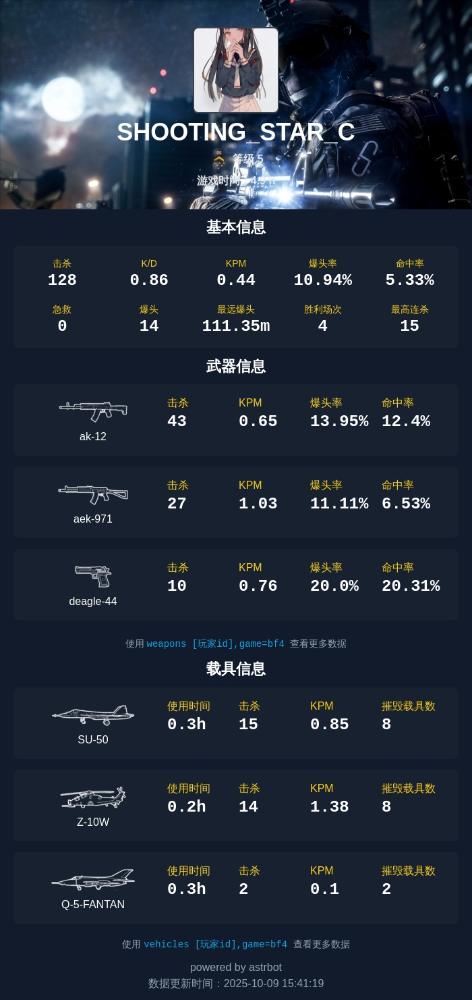
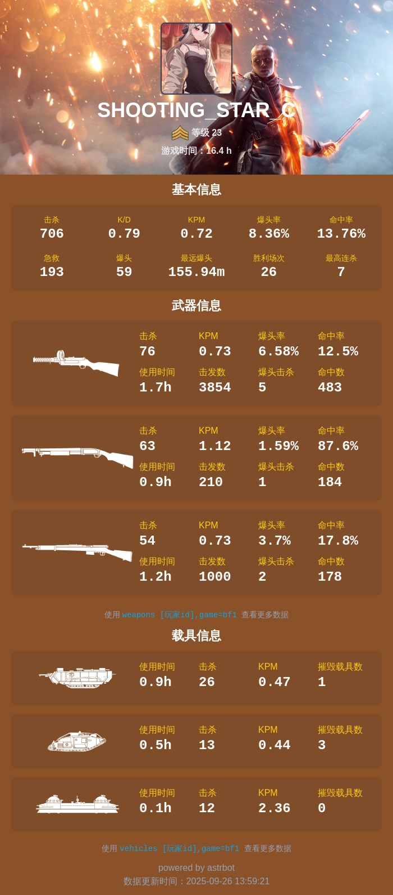
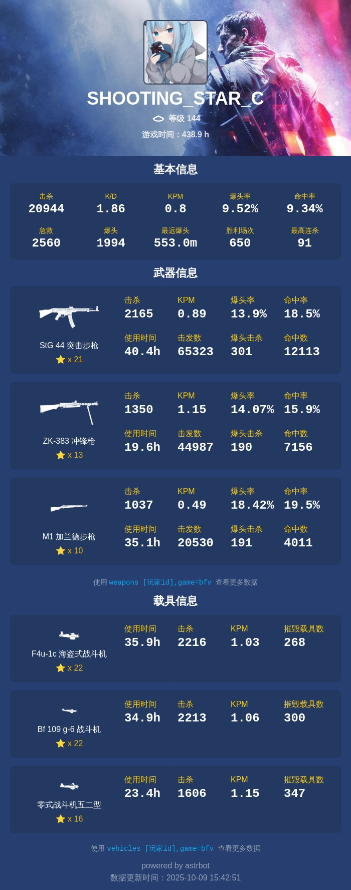
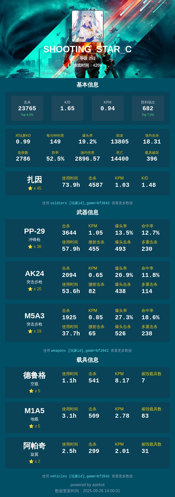

# astrbot_plugin_battlefield_tool

# ✨Astrbot 战地风云战绩查询插件
[](https://www.gnu.org/licenses/agpl-3.0.html)
[](https://www.python.org/)
[](https://github.com/Soulter/AstrBot)

一个基于 Astrbot 的战地系列游戏(BF1/BF4/BF5/BF2042)战绩统计查询插件，支持：

- 玩家战绩查询
- 武器/载具统计
- 服务器查询

## ✨ update 更新 
1.9.0：可查询bf2042


## 🎮 支持游戏

- ✅ **战地4** (Battlefield 4)
- ✅ **战地1** (Battlefield 1)
- ✅ **战地5** (Battlefield V)
- ✅ **战地2042** (Battlefield 2042)

## ⌨️ 使用命令

| 功能        | 命令格式                                     | 参数说明                                | 备注                 | 别名     |
|-----------|------------------------------------------|-------------------------------------|--------------------|--------|
| **账号绑定**  | `{唤醒词}bind [ea_name]`                    | `ea_name`: EA账号名                    | -                  | `/绑定`  |
| **默认查询**  | `{唤醒词}bf_init [游戏代号]`                    | 游戏代号                                | 群聊中仅bot管理员可用       | -      |
| **查询战绩**  | `{唤醒词}stat [ea_name],game=[游戏代号]`        | `ea_name`: EA账号名<br>`game`: 游戏代号    | -                  | -      |
| **武器统计**  | `{唤醒词}weapons [ea_name],game=[游戏代号]`     | `ea_name`: EA账号名<br>`game`: 游戏代号    | -                  | `/武器`  |
| **载具统计**  | `{唤醒词}vehicles [ea_name],game=[游戏代号]`    | `ea_name`: EA账号名<br>`game`: 游戏代号    | -                  | `/载具`  |
| **专家统计**  | `{唤醒词}soldiers [ea_name],game=bf2042`    | `ea_name`: EA账号名<br>`game`: bf2042  | 仅支持bf2042          | `/专家`  |
| **服务器查询** | `{唤醒词}servers [server_name],game=[游戏代号]` | `server_name`: 服务器名<br>`game`: 游戏代号 | -                  | `/服务器` |
| **帮助**    | `{唤醒词}bf_help`                           | -                                   | -                  | -      |
💡 提示

**游戏代号对照表**:
- `bf4`: 战地风云4
- `bf1`: 战地风云1
- `bfv`: 战地风云5
- `bf2042`: 战地风云2042

**命令示例**
- `全参`:/stat shooting_star_c,game=bf4
- `无EA账号名`:/stat game=bf4
- `无游戏代号`:/stat shooting_star_c
- `无参`:/stat

## 🌟 功能预览

<div>
  
  
  
  
</div>

## 📌 注意事项

- html转图服务能力来自[CampuxUtility](https://github.com/idoknow/CampuxUtility)  
astrbot自带的文转图可能不稳定， 如果条件允许建议自部署一个，详见[Astrbot文档](https://astrbot.app/)的其他章节
- bf2042-api 如果没有token则限制每分钟访问10次，有需求请加群联系我

## 👍致谢
### 🎮 数据服务
- [api.gametools.network](https://api.gametools.network) - 提供战地系列游戏数据的API接口

### 💻 开源项目
- [nonebot-plugin-bfchat](https://github.com/050644zf/nonebot-plugin-bfchat) - 参考了其HTML样式设计

### 🖼️ 资源托管
- [路过图床](https://imgse.com/) - 提供图片托管服务

### 🥰 特别感谢 
- [@EIA2024](https://github.com/EIA2024) 的贡献！
- [@chawu691](https://github.com/chawu691) 的贡献！

🙌 衷心感谢所有使用者和贡献者的支持！您的反馈和建议是我们持续改进的动力！

### 📢 问题反馈
提交issue或者加qq群：390654767


## 🤝 参与贡献
欢迎任何形式的贡献！以下是标准贡献流程：

1. **Fork 仓库** - 点击右上角 Fork 按钮创建您的副本
2. **创建分支** - 基于开发分支创建特性分支：
   ```bash
   git checkout -b feature/your-feature-name
   ```
3. **提交修改** - 编写清晰的提交信息：
   ```bash
   git commit -m "feat: 添加新功能" -m "详细描述..."
   ```
4. **推送更改** - 将分支推送到您的远程仓库：
   ```bash
   git push origin feature/your-feature-name
   ```
5. **发起 PR** - 在 GitHub 上创建 Pull Request 到原仓库的 `main` 分支

## 📜 开源协议
1.9.0已从 MIT 协议变更为 AGPL-3.0 协议。

本项目采用 [GNU Affero General Public License v3.0](LICENSE)
